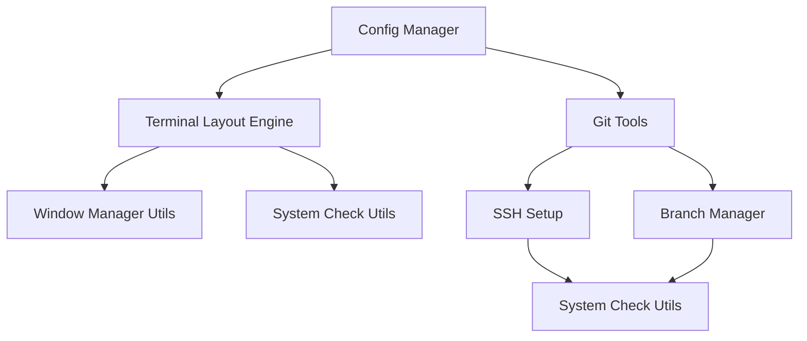

# Project Structure

## Directory Layout
```
terminal-layout/
├── src/                          # Source code
│   ├── terminal-layout.sh        # Main terminal positioning script
│   ├── git-tools/                # Git management utilities
│   │   ├── ssh-setup.sh         # SSH key management
│   │   └── branch-manager.sh    # Branch/commit management
│   └── utils/                    # Utility functions
│       ├── window-manager.sh     # Window manipulation functions
│       └── system-check.sh       # System compatibility checks
│
├── config/                       # Configuration files
│   ├── layouts/                  # Terminal layout presets
│   └── git-templates/           # Git commit message templates
│
├── tests/                        # Test suite
│   ├── unit/                     # Unit tests
│   │   ├── window-tests.sh      # Window management tests
│   │   └── git-tools-tests.sh   # Git utilities tests
│   └── integration/             # Integration tests
│
├── docs/                         # Documentation
│   ├── api/                     # API documentation
│   ├── examples/                # Usage examples
│   └── development/            # Development guides
│
├── scripts/                      # Helper scripts
│   ├── install.sh              # Installation script
│   └── setup-dev.sh           # Dev environment setup
│
└── tools/                        # Development tools
    ├── lint/                    # Linting configuration
    └── hooks/                   # Git hooks
```

## Module Overview

### Core Modules

#### Terminal Layout Engine (`src/terminal-layout.sh`)
- Window positioning algorithm
- Screen dimension detection
- Multi-monitor support
- Layout persistence

#### Git Tools (`src/git-tools/`)
- SSH key management and GitHub integration
- Branch naming convention enforcement
- Commit message formatting
- Interactive rebase helper
- Merge conflict resolution

#### Utility Functions (`src/utils/`)
- Window manager abstraction layer
- System compatibility checking
- Error handling and logging
- Configuration management

### Configuration System

#### Layout Configuration (`config/layouts/`)
- Default layout presets
- Custom layout definitions
- Monitor configuration
- Window sizing rules

#### Git Templates (`config/git-templates/`)
- Commit message templates
- Branch naming patterns
- PR templates
- Code review checklists

### Testing Framework

#### Unit Tests (`tests/unit/`)
- Window management tests
- Git utility tests
- Configuration validation
- Error handling verification

#### Integration Tests (`tests/integration/`)
- Full workflow testing
- Cross-module interaction tests
- System compatibility tests

### Development Tools

#### Installation (`scripts/`)
- System dependency checking
- Configuration setup
- Permission management
- Path configuration

#### Development Utilities (`tools/`)
- Code linting rules
- Git hooks for quality control
- Development environment setup
- Build scripts

## Module Dependencies


## Design Principles
1. **Modularity**: Each component has a single responsibility
2. **Testability**: All modules have corresponding test files
3. **Configuration**: External configuration for customization
4. **Documentation**: Each module includes usage examples
5. **Error Handling**: Comprehensive error management
6. **Compatibility**: Cross-platform support where possible

## Development Guidelines
- Follow shell script best practices
- Document all functions with examples
- Write tests before implementing features
- Keep modules focused and small
- Use consistent naming conventions
- Maintain backwards compatibility
- Log all significant operations

## Future Module Considerations
- Color scheme manager
- Layout animation system
- Plugin system for extensions
- Remote configuration sync
- Performance monitoring
- Backup/restore system

## Version Control Structure
- Feature branches for new modules
- Development branch for integration
- Main branch for stable releases
- Tagged releases with semantic versioning
- Protected branches with review requirements

## Notes
- Each module should have a README
- Configuration files use YAML format
- All scripts should be POSIX compliant
- Error messages should be user-friendly
- Logging levels should be configurable
